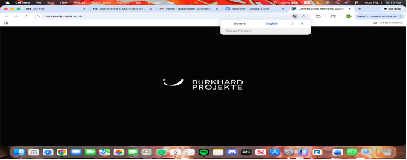
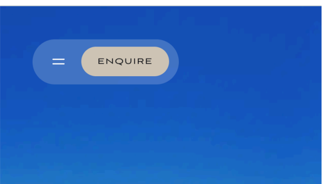
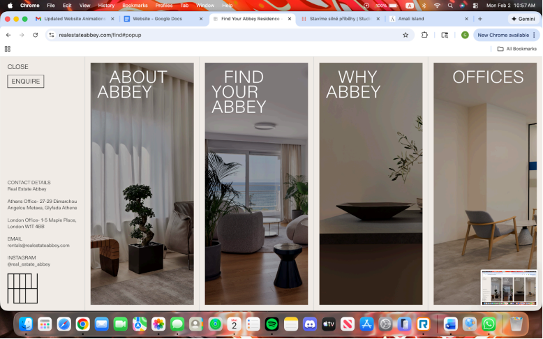
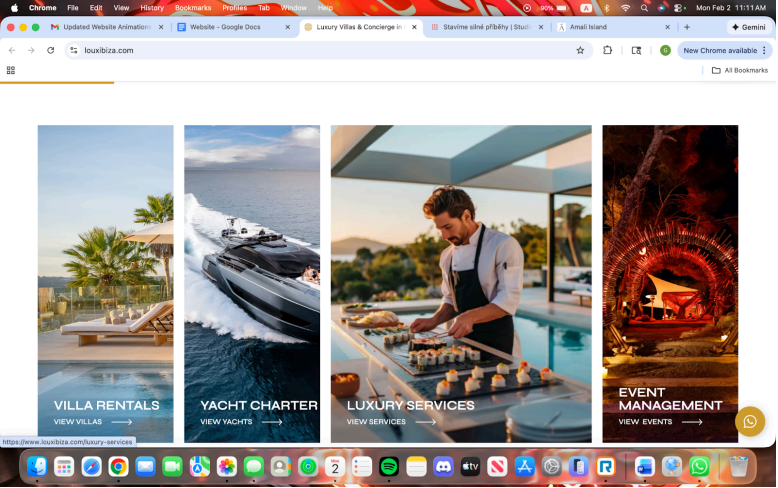
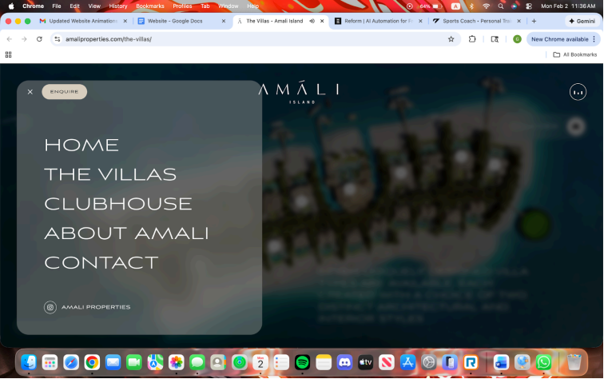
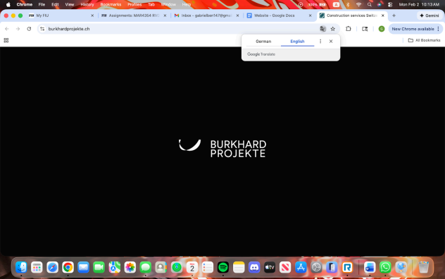

# Website: The Floral Collection  
# Homepage  
Immediately when visiting website, logo and name will be shown with the animation in this website https://www.burkhardprojekte.ch/ The picture you see below shows an animation when loading this website, where the company name and logo show up in the middle and spin, that is what I want.  
  

	

  
After the logo and company name is shown, it will then move to the top middle of the page like this website “https://www.elicyon.com/” When clicking on this website, you will see the website loading, then you will the company name go from the middle of the screen to the top middle and become smaller, that is what I want for my website.  
  

	

  

	
[page1]

  

___  
Menu and logo should be up top in the style of this website https://amaliproperties.com/ As you see here, this is how I want my menu button to be shown. Also, when a person is scrolling down on whichever page on the website, I still want the menu option to show in small, in the top left corner, and the company name in the middle, so they don’t have to scroll all the way to the top of the page to click on the menu option or the company name which will take them back to the home page.  
  

	

  
The next page will use “https://realestateabbey.com/find” where its 4 columns fill the whole page evenly. When hovering over a column, a  description is shown.  
  

	
[page2]

  

___  
As you see in this picture and on this website, https://realestateabbey.com/find, you see four columns. What I want are 4 columns that take up the entire page evenly.  
  

	

  
When hovering over a column, it will widen like in this website  
  
“https://www.louxibiza.com/” What you see here on this website, when you  
  
scroll down from the homepage, you see these columns. When you put your  
  
cursor on top of one of these columns, the columns widens up and becomes  
  
bigger, that is what I want for my three columns for the services, but the  
  

	
[page3]

  

___  
same animation as I have listed up above, as: https://www.qcif.edu.au/  
  

	

  
1st column (all the way on left): Essential Package 2nd column (second from left): Plus Package 3rd column (third from left): Luxe Package 4th column (all the way on right): Elite Package  
  

	
[page4]

  

___  
When clicking on menu tab, it should be like: https://amaliproperties.com/the-villas/ On this website, when you click on the menu option, I want my website to have the same kind of animation, to look like this, the picture down below. Click on the link for this website and you will see.  
  

	

  
After clicking on a tab, as the page is loading to the next page, I want the same animation as the initial loading screen of the website: https://www.burkhardprojekte.ch/ I have here the link to the first website I have listed on the top of this document. What I want is the same animation as when you click on the website. Where my company name and logo appear in the middle and have the spinning animation. That is what I want when I click on any tab on the website, when the page loads to the tab page,  
  

	
[page5]

  

___  
I want the loading animation to be my company name and logo spinning in  
  

	

  
the middle.  
  
# Tabs:  
1. Essential Package  
2. Plus Package  
3. Luxe Package  
4. Elite Package  
5. About Us  
6. Technology  
7. Markets We Serve  

	
[page6]

  

___  

	
[page7]

  

___  
